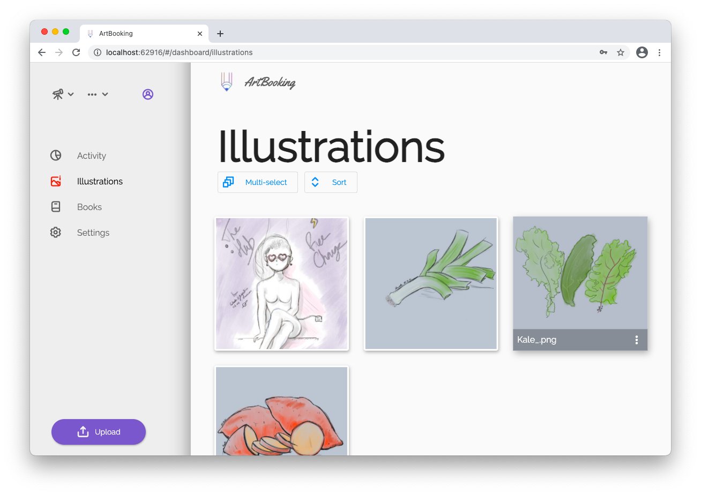

  

Your inspirational space.

  

> Early stage development

# Status

- [Status](#status)
- [Download](#download)
- [Presentation](#presentation)
- [Technologies](#technologies)
  - [Frontend](#frontend)
  - [Backend](#backend)
  - [Authentication](#authentication)
  - [Cloud Functions](#cloud-functions)
- [Contributing](#contributing)
- [Licence](#licence)

# Download

  

 
 
 

# Presentation

An online platform to share your personal illustrations.

The initial purpose was to provide a right way to create a portfolio with flexible layout.

# Technologies

## Frontend

[Flutter](https://flutter.dev) is used for the mobile (Android/iOS) and web apps. It allows to maintain a single code base and simplified the development in some cases. It also complicated the code architecture and the repository structure must be thoroughly managed.

## Backend

For the backend, [Firestore](https://firebase.google.com/docs/firestore) is used as the database. It's a flexible, scalable noSQL database for mobile, web and server development from Firebase and Google Cloud Platform.

## Authentication

Firebase Auth handles users' account creation, connections, third-party authentication, email & password update, account deletion, among other scenarios.

## Cloud Functions

Firebase Cloud Functions is used for security checks when updating user's account for example. It's used for statistics too and for delayed deletion.

More about why and how I made these devlopment decisions in future [blog posts](https://rootasjey.dev).

# Contributing

> You won't be able to launch the app locally for now without Firebase configuration file. You can contact us by opening a new issue if you're motivated.

You can contribute by:

* open a new issue to report a bug
* make a feature suggestion

# Licence

[Mozilla Public License Version 2.0](./LICENSE)

