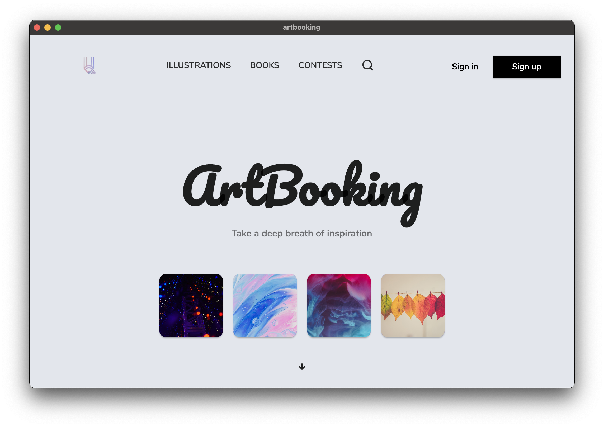

  

Your inspirational space.

  

> Early stage development

# Status

- [Status](#status)
- [Download](#download)
- [Presentation](#presentation)
- [Development](#development)
  - [Frontend](#frontend)
  - [Backend & Services](#backend--services)
    - [🗄️ Database](#️-database)
    - [🔑 Authentication](#-authentication)
    - [🌩️ Cloud Functions](#️-cloud-functions)
- [Contributing](#contributing)
- [Sponsors](#sponsors)
- [Licence](#licence)

# Download

  

 
 
 

# Presentation

An online platform to share your personal illustrations.

ArtBooking provides a virtual space to share your illustration with others.
It also has a lot more features:

* Create art books (portfolio)
* An artistic profile (like a hub)
* Open and welcome community (whatever your skills)
* Organize challenges and contests

We would also like to provide a secure and easy way to do financial transactions
between artists and clients. Artists could sell individual printing.
An even more exciting idea would be to subscribe (financially) to loved artists. 
With a recurring fee, this could allow someone to work a little more peacefully.

This project is in (very) early devevelopment phase, and we want to work on it in a long term. 
If you take one isolated feature, the idea is not unique in itself, but is exciting if you think 
about the whole picture.

We are building applications on several platforms including Web and Android in prority.
Other platforms will eventually be supported thanks to Flutter SDK.

# Development

## Frontend

We use [Flutter](https://flutter.dev) to develop Web and Mobile (Android/iOS) apps. 
Flutter may no be the best technology to create a web app right now but tt allows us to maintain a single code base. 
We hope it will improve over time (perfomance, loading time, accessibility, SEO, ...).

However, Flutter is efficient for the mobile part. Plus [Dart](https://dart.dev) is a nice language to work with.

## Backend & Services

We use a lot of cloud services for the backend. Right now we have not a dedicated persistent server. 

### 🗄️ Database

To storage our data, we use [Firestore](https://firebase.google.com/docs/firestore) as the database. 
It's a flexible, scalable noSQL database from Google.

### 🔑 Authentication

Firebase Auth handles users' account creation, connections, third-party authentication, email & password update, account deletion, among other scenarios.

### 🌩️ Cloud Functions

Firebase Cloud Functions is used for security checks when updating user's account for example. It's used for statistics too and for delayed deletion.

More about why and how I made these devlopment decisions in future [blog posts](https://rootasjey.dev).

# Contributing

You won't be able to launch the app locally for now without Firebase configuration file. You can contact us by opening a new issue if you're motivated.

Right now, you can contribute by:

* open a new issue to report a bug
* make a feature suggestion

We plan to create a didicated API for developers and contributors which will allow 
everyone to run the app in a local environment.

# Sponsors

This inspiring project is looking for sponsors and financial support.

# Licence

[Mozilla Public License Version 2.0](./LICENSE)

